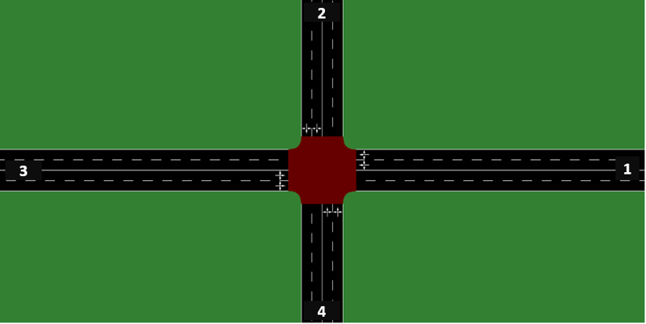
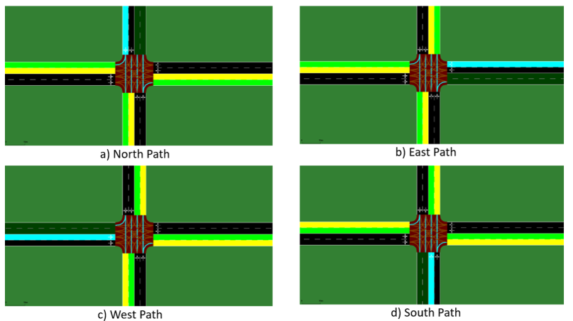

# Akıllı Trafik Sinyalizasyon Sistemlerinin İyileştirilmesi

Projenin amacı, bulanık mantık kullanılarak trafik sinyalizasyon sistemlerinin iyileştirilmesi, trafikte araç ve yayaların bekleme sürelerinin azaltılmasıdır.

  
   
  <strong>Şekil-1</strong>: Gerçek bir dört yönlü kavşağın çizimi.

- Faz 1: yol 2 ve 4
- Faz 2: yol 1 ve 3

  
   
  <strong>Şekil-2</strong>: Her yol için araçların olası dönüş yönleri.

Mavi çizgi araçların o anki konumunu, yeşil çizgiler ise mevcut dönüş yönlerini göstermektedir.

### Repository Yapısı

Repository iki ana klasörden oluşmaktadır: "Code", "Sumo".

#### Code
"Code" klasörünün içerisinde projenin Python scriptlerini bulabilirsiniz.

#### Sumo
"Sumo" klasörü dört farklı Sumo trafik senaryosu içermektedir:

1. Gerçek senaryo
2. Faz 1'de daha yüksek yoğunluklu senaryo
3. Faz 2'de daha yüksek yoğunluklu senaryo
4. Faz 1 ve faz 2'de yaklaşık olarak eşit yoğunluklu senaryo

### Projeyi Çalıştırmak

Projeyi çalıştırmak için aşağıdaki adımları izleyebilirsiniz:

1. Repository'i makinenize indirin.
2. `code/constant_definitions.py` dosyasındaki `base_path` değişkenini projenin bulunduğu yola uyacak şekilde değiştirin.
3. Projeyi başlatmak için main dosyasını çalıştırın.
